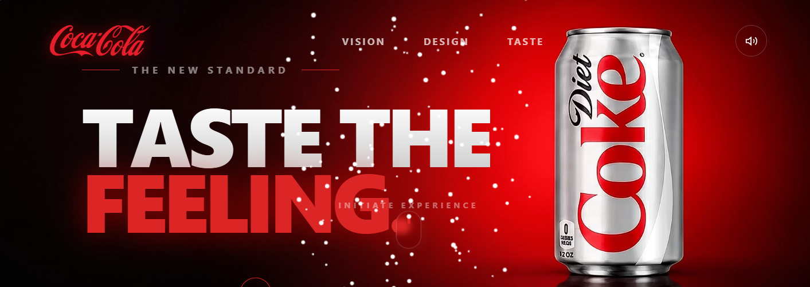

# 🥤 Coke Vibe Experience

An immersive and premium Coca-Cola inspired landing page built with modern web technologies. This project combines smooth animations, interactive visual effects, cinematic transitions, and synchronized audio experiences to create a high-end product showcase.



---

## ✨ Features

### 🎨 Premium Hero Section
- Bold typography and branding
- Dynamic Coca-Cola inspired red-black gradient theme
- Floating particle effects
- Interactive navigation transitions

### 🥤 Product Showcase
- High-quality Diet Coke can visualization
- Smooth entrance animations
- Responsive positioning and scaling
- Product-focused storytelling

### 🎵 Audio Experience
- Integrated sound effects
- Background audio controls
- Enhanced immersive user experience

### ⚡ Advanced Animations
- Scroll-triggered animations
- Motion-based transitions
- Floating particle system
- Smooth hover interactions

### 📱 Responsive Design
- Desktop optimized
- Tablet compatible
- Mobile-friendly layout
- Fluid scaling across screen sizes

---

## 🛠️ Tech Stack

### Frontend
- React
- TypeScript
- Vite
- HTML5
- CSS3

### Animation & Effects
- CSS Animations
- Scroll-based Interactions
- Custom Particle Effects

### Media Processing
- Python Scripts
- Audio Extraction Utilities

---

## 📂 Project Structure

```bash
COKE-VIBE-CODE/
│
├── src/
│   ├── App.tsx
│   ├── main.tsx
│   └── index.css
│
├── Photos/
│   └── Assets & Images
│
├── extract.py
├── extract_audio.py
│
├── index.html
├── style.css
│
└── README.md
```

---

## 🚀 Getting Started

### Clone the Repository

```bash
git clone https://github.com/yourusername/coke-vibe-experience.git
```

### Navigate into the Project

```bash
cd coke-vibe-experience
```

### Install Dependencies

```bash
npm install
```

### Start Development Server

```bash
npm run dev
```

### Build for Production

```bash
npm run build
```

### Preview Production Build

```bash
npm run preview
```

---

## 🎯 Design Inspiration

This project is inspired by premium product advertising experiences commonly seen in:

- Coca-Cola Campaigns
- Apple Product Pages
- Nike Interactive Launches
- High-end Brand Storytelling Websites

The goal was to create a cinematic and engaging digital experience that feels more like an advertisement than a traditional website.

---

## 📸 Screenshots

### Hero Section

- Red and black gradient lighting
- Floating particle effects
- Product-focused composition
- Immersive typography

### Product Experience

- Smooth animations
- Interactive transitions
- Dynamic storytelling sections

---

## 🔥 Future Improvements

- GSAP integration
- Three.js 3D can model
- Advanced parallax effects
- Dynamic audio synchronization
- Performance optimizations
- Mobile-specific animation system

---

## 🤝 Contributing

Contributions, ideas, and improvements are welcome.

1. Fork the repository
2. Create a new branch

```bash
git checkout -b feature/new-feature
```

3. Commit your changes

```bash
git commit -m "Add new feature"
```

4. Push to your branch

```bash
git push origin feature/new-feature
```

5. Open a Pull Request

---

## 📄 License

This project is intended for educational and portfolio purposes.

Coca-Cola® trademarks, logos, and branding belong to The Coca-Cola Company.

---

## 👨‍💻 Author

**Gaurav Singh Chauhan**

Frontend Developer | UI/UX Enthusiast | Interactive Web Experiences

If you like this project, consider giving it a ⭐ on GitHub.
